# Camera Calibration and Stereo Vision 

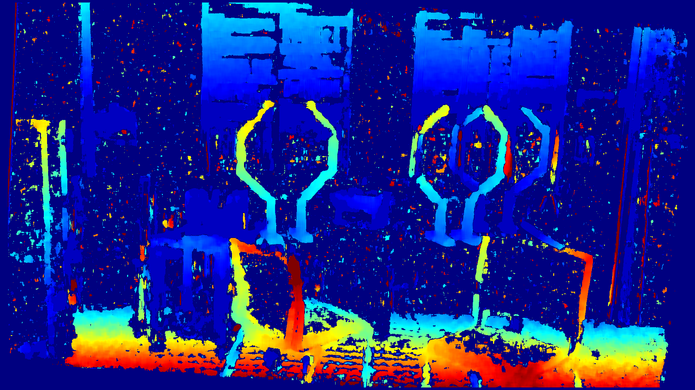

## **Camera Calibration for a Single Camera**

### Overview 

This section is designed to calibrate a single camera using a calibration board, and it’s structured into four primary stages: image collection, calibration processing, reprojection error analysis, and result visualization. By leveraging established OpenCV functions, the pipeline efficiently computes the camera’s intrinsic parameters (such as focal length, principal point, and distortion coefficients) as well as its extrinsic parameters (rotation and translation vectors). The end goal is to undistort images and quantify calibration accuracy through reprojection error analysis while providing visual confirmation of the calibration quality.

---

### Key Features 

1. **Image Collection**

    - Approximately **50 images** are captured using a calibration board (chessboard or circular pattern) from various angles and under different lighting conditions. This ensures robust calibration by providing varied perspectives.
    - **Note:** For this project, chessboard pattern was used for camera calibration. 

        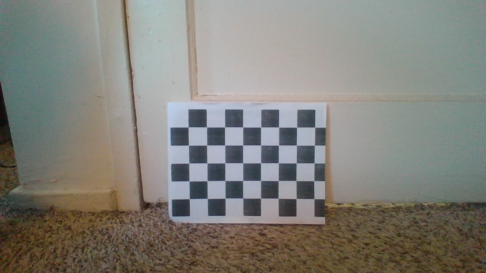

2. **Calibration Pipeline**

    - **Automated Image Acquisition and Preprocessing**
        - Loads calibration images from a specified directory (e.g., from Google Drive).
        - Converts each image to grayscale for processing.
        - Handles image read failures gracefully.
    
    - **Chessboard Pattern Detection**
        - Uses a configurable chessboard pattern (with a defined number of inner corners) for calibration.
        - Employs `cv2.findChessboardCorners` with adaptive thresholding for robust corner detection.

    - **Subpixel Accuracy Refinement**
        - Refine the detected corner coordinates to get subpixel accuracy, enhancing calibration precision using `cv2.cornerSubPix`.
    
    - **3D-2D Correspondence Collection**
        - A grid of 3D world coordinates (object points) is predefined corresponding to the chessboard’s geometry.
        - Collects and stores the corresponding 2D image points (refined chessboard corners) from each valid image.

    - **Camera Calibration Execution**
        - Perform camera calibration using `cv2.calibrateCamera` to compute:
            - The camera matrix (intrinsic parameters)
            - Lens distortion coefficients
            - Rotation and translation vectors (extrinsic parameters)

    - **Reprojction Error Analysis**
        - Projecting the 3D object points back onto the image plane using the estimated parameters.
        - Calculating the reprojection error for each image (using the L2 norm) and computes the mean error.

---

### Pre-requisites

Open the `.ipynb` file in Jupyter Notebook or oepn it in Google colab. Run each tab of **Camera Calibration Pipeline** sequentially. 

---

### Usage

Follow the instructions in the`project.ipynb` file and run the pipeline. 

---

### Results:

1. **Reprojection Error**

    The reprojection error is calculated by comparing the projected image points with the detected image points using the **Euclidean norm (L2 norm)**.

    - The reprojection error is a crucial metric in camera calibration that quantifies the accuracy of the estimated camera parameters. 
    - It measures the disparity between the observed image points (detected corners) and their corresponding projected image points (reprojected from known 3D world) using the calibrated camera parameters. This provides a quantative measure of how well the estimated cmaera parameters fit the observed image data.
    - A low reprojection error indicates a close alignment between the observed and projected image points, suggesting high calibration accuracy.

        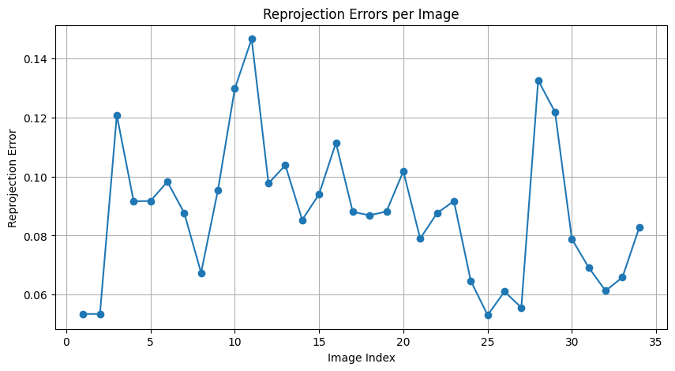

2. **Overlayed Points on the Undistorted Image**

    - Detected and reproejcted points overlayed on the image, where detected points are in red and reprojected points are in white. 

        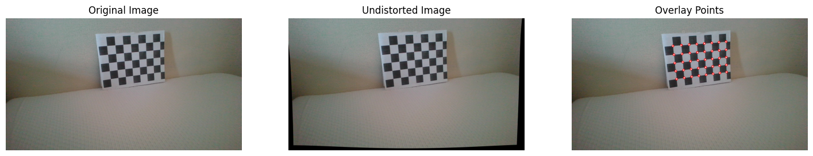

---

## **Stereo Vision System**

### Overview

This section is the implementation of the **Stereo Vision** Pipeline, enabling computation of disparity maps and depth images from stereo image pairs to represent the spatial dimensions of the scene. The pipeline follows the below steps:

1. **Image Processing:** Read the pair of images and the camera calibration parameters. 
2. **FLANN-based Feature Matching:** Detect and match the keypoints between the pair of stereo images. Filter out good matches. 
3. **Fundamental Matrix and Essential Matrix:** Compute these matrices to get the geometric relationship between the images.
4. **Image Rectification:** Align the images to simplify the diasparity computation.
5. **Disparity Map Calculation:** Compute the disparity map representing the pixel-wise diffeences between the two images.
6. **Depth Map Generation:** Convert the disparity maps to depth maps for 3D preception.

---

### Features 

- **Read Images:** Load the stereo image pairs and their calibration parameters.
- **Feature matching:** Utilizes SIFT and FLANN based matching for accurate feature matching.
- **Visualize Epipolar Geomerty:**Drawing the Epipolar lines and feature points to visualzie geometric relationships.
- **Stereo Rectification:** Aligning the images to ensure that corresponding feature points lie on the same epipolar line(horizontal line).
- **Disparity and Depth Maps:** Computes and visualizes disparity and depth maps for preception of stereo vision. 

---

### Usage

- This section is orignally executed in Google Colab. 
- The **Stereo Vision System** is tested on three datasets namely `Classroom`, `Storageroom` and `traproom`. The camera calibration parameters are stord in the `Dataset/<Yourdatasetname>` in `.txt` format. 
- Parameters present in the `.txt` file:

    <table>
    <thead>
        <tr>
        <th>Parameter</th>
        <th>Description</th>
        </tr>
    </thead>
    <tbody>
        <tr>
        <td>cam0, cam1</td>
        <td>Camera matrices for the rectified views, in the form [f 0 cx; 0 f cy; 0 0 1].</td>
        </tr>
        <tr>
        <td>f</td>
        <td>Focal length in pixels.</td>
        </tr>
        <tr>
        <td>cx, cy</td>
        <td>Principal point coordinates.</td>
        </tr>
        <tr>
        <td>doffs</td>
        <td>X‐difference of principal points, doffs = cx1 – cx0 (in this case always 0).</td>
        </tr>
        <tr>
        <td>baseline</td>
        <td>Camera baseline in millimeters.</td>
        </tr>
        <tr>
        <td>width, height</td>
        <td>Image size (in pixels).</td>
        </tr>
        <tr>
        <td>ndisp</td>
        <td>
            A conservative bound on the number of disparity levels; the stereo algorithm
            <em>may</em> utilize this bound and search from d = 0 to d = ndisp - 1.
        </td>
        </tr>
        <tr>
        <td>vmin, vmax</td>
        <td>
            A tight bound on the minimum and maximum disparities, used for color visualization;
            the stereo algorithm <em>may not</em> utilize this information.
        </td>
        </tr>
    </tbody>
    </table>

---

### Results 

1. **Classroom**

    - **Epipolar lines and feature points on the Rectified Image**

        <table>
        <tr>
        <td>
        <figure>
        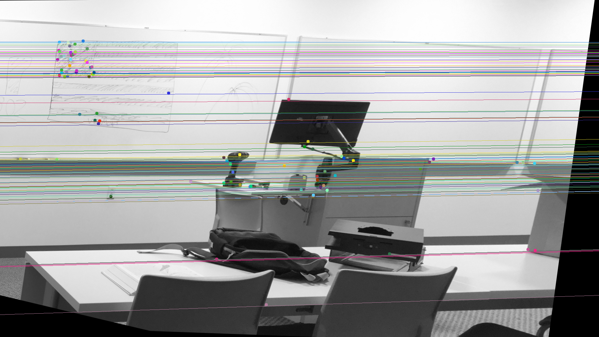
        </figure>
        </td>
        <td>
        <figure>
        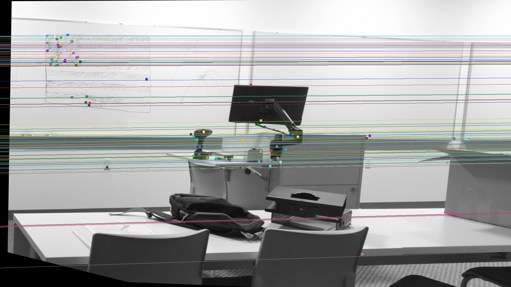
        </figure>
        </td>
        </tr>
        </table>

    - **Disparity Map representing pixel-wise differences between the two images(grayscale)**

        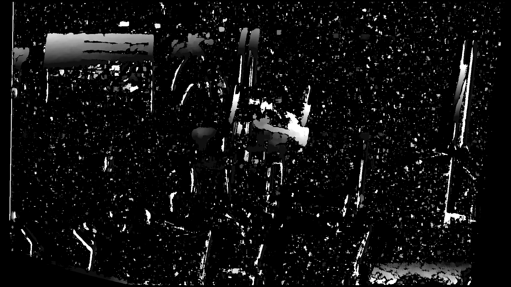

    - **Disparity Map representing pixel-wise differences between the two images(color)**

        

    - **Depth Map representing Spatial Dimensions of the scene(color)**

        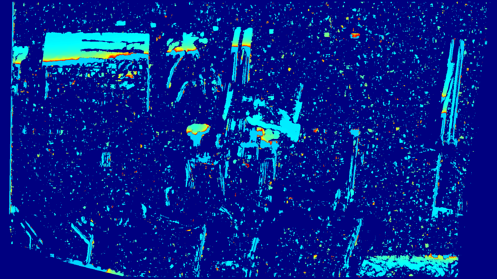

    - **Depth Map representing Spatial Dimensions of the scene(grayscale)**

        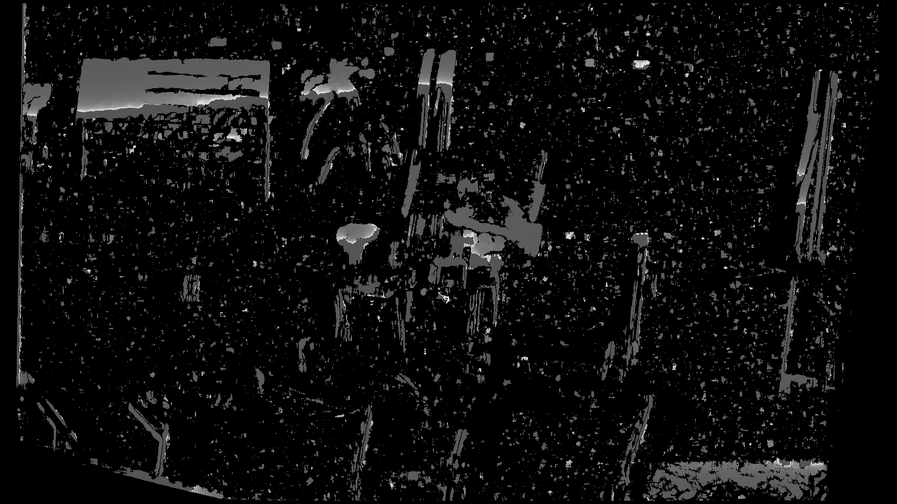

2. **Storageroom**

    - **Epipolar lines and feature points on the Rectified Image**

        <table>
        <tr>
        <td>
        <figure>
        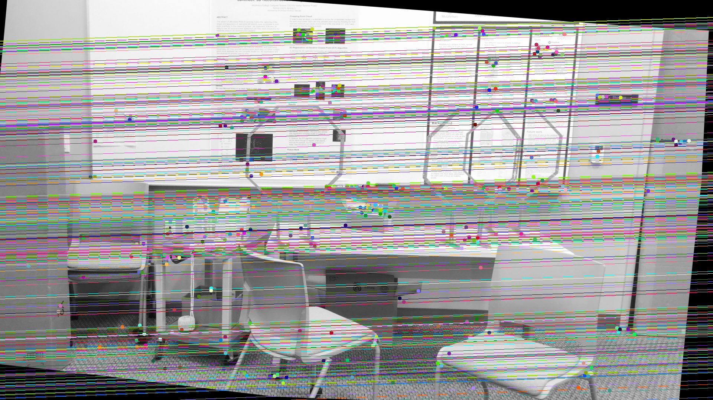
        </figure>
        </td>
        <td>
        <figure>
        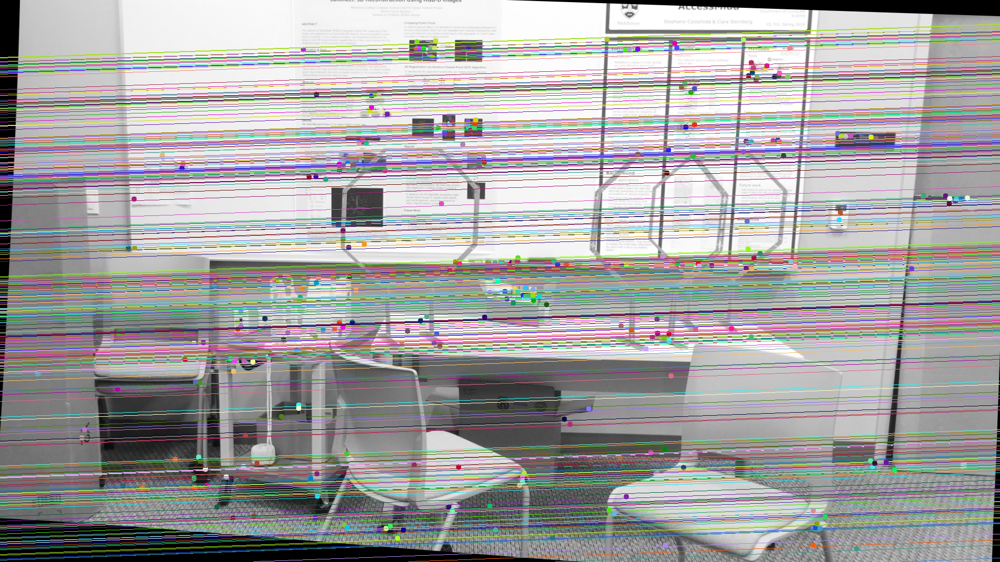
        </figure>
        </td>
        </tr>
        </table>

    - **Disparity Map representing pixel-wise differences between the two images(grayscale)**

        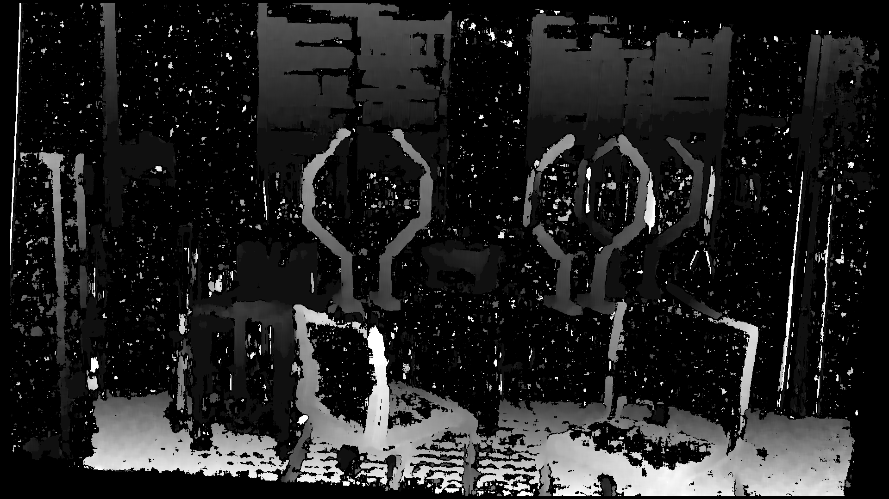

    - **Disparity Map representing pixel-wise differences between the two images(color)**

        

    - **Depth Map representing Spatial Dimensions of the scene(color)**

        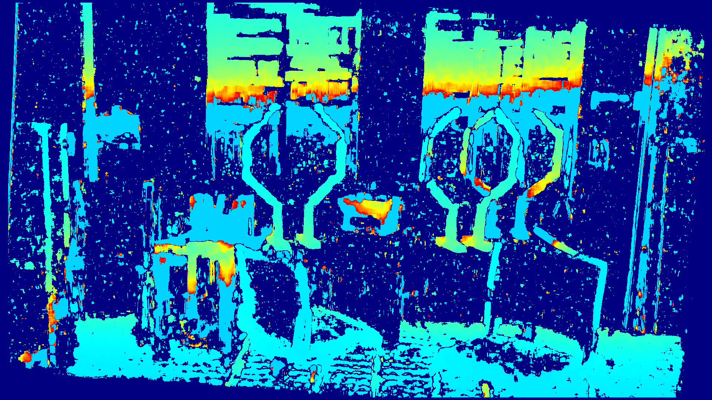

    - **Depth Map representing Spatial Dimensions of the scene(grayscale)**

        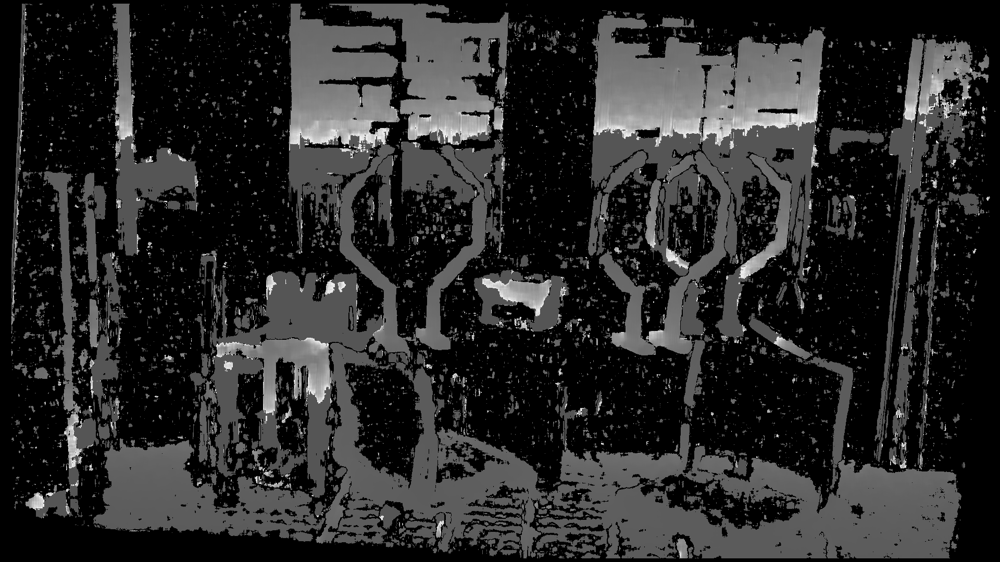

3. **Traproom**

    - **Epipolar lines and feature points on the Rectified Image**

        <table>
        <tr>
        <td>
        <figure>
        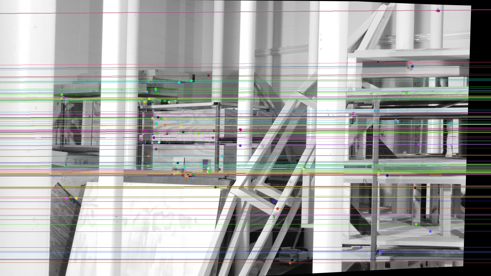
        </figure>
        </td>
        <td>
        <figure>
        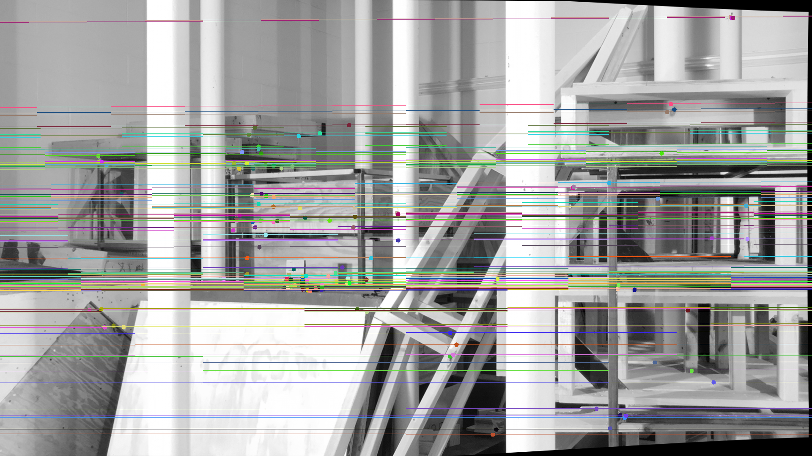
        </figure>
        </td>
        </tr>
        </table>

    - **Disparity Map representing pixel-wise differences between the two images(grayscale)**

        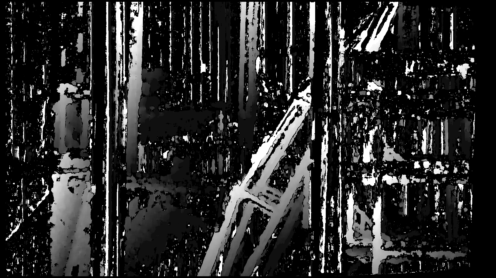

    - **Disparity Map representing pixel-wise differences between the two images(color)**

        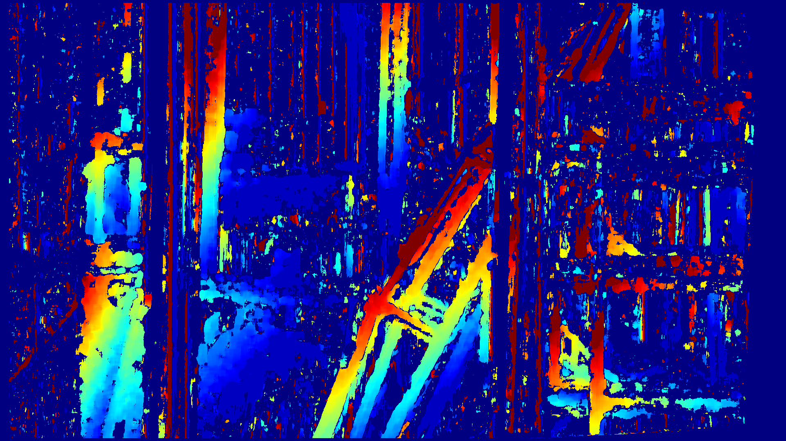

    - **Depth Map representing Spatial Dimensions of the scene(color)**

        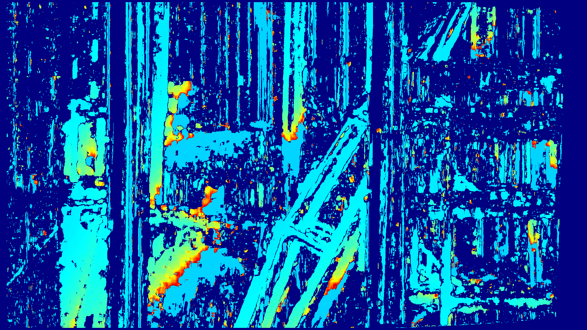

    - **Depth Map representing Spatial Dimensions of the scene(grayscale)**

        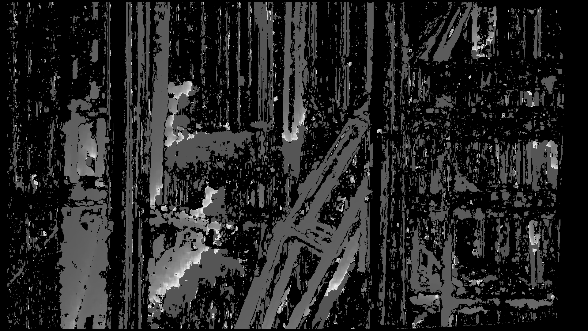

---

